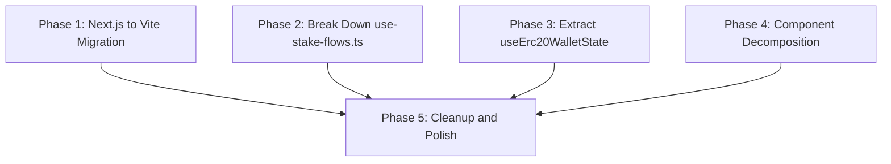

# Refactor SSV Staking App

## Problem Summary

This is a single-page Web3 staking dApp (wagmi + RainbowKit + TanStack Query) that was built with Next.js 16 but uses almost none of its features -- no API routes, no middleware, no server-side data fetching, no `next/link`, no `next/navigation`. The app has a single route (`/`) where everything is client-rendered.

The main code quality issue is **one massive file** -- `[lib/staking/use-stake-flows.ts](lib/staking/use-stake-flows.ts)` at **1121 lines** -- that handles all transaction flows (stake, unstake, withdraw, claim) with heavily duplicated patterns. Several components are also oversized with repeated UI patterns.

---

## Phase 1: Migrate from Next.js to Vite + React SPA

**Why:** Next.js is unjustified here. The only Next.js features used are:

- `next/image` (8 components) -- replace with `` tags (images are already static SVGs, no optimization needed)
- `next/font/google` (layout.tsx) -- replace with `@fontsource` packages or `<link>` tags
- `export const metadata` (layout.tsx) -- replace with static `<meta>` tags in `index.html`
- `output: "standalone"` -- replace with static file hosting

There are **zero** API routes, **zero** server-side fetches, and **zero** uses of `next/link` or `next/navigation`.

### Tasks

**1.1** -- Initialize Vite + React + TypeScript config  

- Add `vite.config.ts` with `@vitejs/plugin-react`, path alias `@/` -> `./`  
- Update `tsconfig.json` (remove Next.js plugin, adjust for Vite)  
- Create `index.html` with fonts (`<link>` to Google Fonts for Manrope + DM Sans), meta tags (title, description, OG, twitter), and `
`  
- Create `src/main.tsx` entry point rendering `<App />`

**1.2** -- Migrate app shell  

- Convert `app/layout.tsx` -> `src/App.tsx` (move font CSS variables to `index.html`, move `<Providers>` + `<MaintenanceGuard>` + `<Toaster>` here)  
- Convert `app/page.tsx` -> inline into `App.tsx` (it just renders `<TopBar>` + `<StakingInterface>`)  
- Move `app/providers.tsx` -> `src/providers.tsx` (remove `"use client"` directives)  
- Move `app/globals.css` -> `src/globals.css`

**1.3** -- Replace `next/image` with `` across 8 files  

- `[components/maintenance.tsx](components/maintenance.tsx)`  
- `[components/staking-interface.tsx](components/staking-interface.tsx)`  
- `[components/staking/staking-header.tsx](components/staking/staking-header.tsx)`  
- `[components/staking/stake-tabs.tsx](components/staking/stake-tabs.tsx)`  
- `[components/staking/staking-balances.tsx](components/staking/staking-balances.tsx)`  
- `[components/staking/token-input-card.tsx](components/staking/token-input-card.tsx)`  
- `[components/top-bar.tsx](components/top-bar.tsx)`  
- `[components/ui/primary-action-button.tsx](components/ui/primary-action-button.tsx)`

**1.4** -- Update wagmi config  

- In `[lib/wagmi.ts](lib/wagmi.ts)`, change `ssr: true` to `ssr: false`

**1.5** -- Update build tooling  

- Update `[package.json](package.json)` scripts: `dev` -> `vite`, `build` -> `vite build`, `preview` -> `vite preview`  
- Remove `next`, `eslint-config-next` dependencies; add `vite`, `@vitejs/plugin-react`  
- Update `[Dockerfile](Dockerfile)` for static build output (nginx or serve)  
- Remove `next.config.mjs`, `next-env.d.ts`  
- Update ESLint config to remove Next.js plugin  
- Remove all `"use client"` directives from all files

**1.6** -- Update environment variable handling  

- `NEXT_PUBLIC_`* env vars -> `VITE_`* prefix (in `[lib/config.ts](lib/config.ts)`, `[.env](.env)`, `[.env.stage](.env.stage)`, `[.env.production](.env.production)`)  
- `process.env.NEXT_PUBLIC_`* -> `import.meta.env.VITE_`*

---

## Phase 2: Break Down `use-stake-flows.ts` (1121 lines -> ~6 files)

This is the biggest win. The file has 6+ duplicated patterns.

**2.1** -- Extract `useTransactionReceipt` wrapper hook  

- Create `[lib/staking/hooks/use-tx-receipt.ts](lib/staking/hooks/use-tx-receipt.ts)`  
- Wraps `useWaitForTransactionReceipt` + the receipt effect (success/error handling, toast dismiss, status update)  
- Replaces 7 identical `useWaitForTransactionReceipt` calls + 6 nearly identical `useEffect` blocks (lines 97-137 and 705-926)

**2.2** -- Extract `useTransactionSender` hook  

- Create `[lib/staking/hooks/use-tx-sender.ts](lib/staking/hooks/use-tx-sender.ts)`  
- Encapsulates `useWriteContract` + the `sendTransaction` function (multisig vs ordinary path, toast handling)  
- Replaces lines 97-100 and 183-225

**2.3** -- Extract `createStartTransaction` factory  

- Create `[lib/staking/helpers/start-transaction.ts](lib/staking/helpers/start-transaction.ts)`  
- Generic factory for the 6 identical `start*Transaction` functions that all follow the same pattern: contract wallet branch vs ordinary wallet branch with status/hash management  
- Replaces lines 227-387 (6 functions with identical structure)

**2.4** -- Extract `useWithdrawalSelection` hook  

- Create `[lib/staking/hooks/use-withdrawal-selection.ts](lib/staking/hooks/use-withdrawal-selection.ts)`  
- Manages `selectedWithdrawalIds`, `toggleWithdrawalSelection`, pruning effect, and derived sums  
- Replaces lines 666-677 and 932-950

**2.5** -- Extract `useCooldownClock` hook  

- Create `[lib/staking/hooks/use-cooldown-clock.ts](lib/staking/hooks/use-cooldown-clock.ts)`  
- `nowEpoch` state + `useInterval` refresh every second  
- Replaces lines 928-930 (small but used in multiple places)

**2.6** -- Extract per-flow state hooks  

- Create `[lib/staking/hooks/use-stake-flow-state.ts](lib/staking/hooks/use-stake-flow-state.ts)` -- stake + approval state/handlers  
- Create `[lib/staking/hooks/use-unstake-flow-state.ts](lib/staking/hooks/use-unstake-flow-state.ts)` -- unstake + approval state/handlers  
- Create `[lib/staking/hooks/use-withdraw-flow-state.ts](lib/staking/hooks/use-withdraw-flow-state.ts)` -- withdraw state/handlers  
- Create `[lib/staking/hooks/use-claim-flow-state.ts](lib/staking/hooks/use-claim-flow-state.ts)` -- claim state/handlers  
- Each manages its own `*FlowOpen`, `*Hash`, `*Status`, `handle`*, `retry`*, `start*Transaction`

**2.7** -- Slim down `use-stake-flows.ts` to a thin composer  

- The remaining `useStakeFlows` becomes a ~100-line composition of the above hooks  
- It composes all four flow hooks, the cooldown clock, withdrawal selection, and returns the unified API

---

## Phase 3: Extract `useErc20WalletState` Hook

**3.1** -- Create `[lib/staking/hooks/use-erc20-wallet-state.ts](lib/staking/hooks/use-erc20-wallet-state.ts)`  

- Wraps the repeated pattern in `[lib/staking/use-staking-data.ts](lib/staking/use-staking-data.ts)`: `useBalance` + `useReadContract(decimals)` + `useReadContract(allowance)` for a given token  
- Returns `{ balance, decimals, allowance, refetchBalance, refetchDecimals, refetchAllowance }`  
- Use it twice in `use-staking-data.ts` (for SSV and cSSV), reducing ~50 lines of duplication

**3.2** -- Extract withdrawal request parser  

- Create `[lib/staking/helpers/parse-withdrawal-requests.ts](lib/staking/helpers/parse-withdrawal-requests.ts)`  
- Move the `useMemo` logic (lines 75-111 of `use-staking-data.ts`) that normalizes Hoodi vs stage withdrawal data  
- Makes it independently testable

---

## Phase 4: Component Decomposition

**4.1** -- Split `stake-tabs.tsx` (345 lines) into tab panels  

- Create `[components/staking/tabs/stake-tab-panel.tsx](components/staking/tabs/stake-tab-panel.tsx)` -- stake form + warnings + button  
- Create `[components/staking/tabs/unstake-tab-panel.tsx](components/staking/tabs/unstake-tab-panel.tsx)` -- withdrawal list + unstake form  
- Create `[components/staking/tabs/claim-tab-panel.tsx](components/staking/tabs/claim-tab-panel.tsx)` -- claim display + button  
- Keep `stake-tabs.tsx` as the tab container (~50 lines)

**4.2** -- Extract `WithdrawalRequestsList` component  

- Create `[components/staking/withdrawal-requests-list.tsx](components/staking/withdrawal-requests-list.tsx)`  
- Move the inline IIFE (lines 203-262 of `stake-tabs.tsx`) -- unlocked aggregate row + locked rows with countdown

**4.3** -- Extract `StakingWarningBanner` component  

- Create `[components/ui/warning-banner.tsx](components/ui/warning-banner.tsx)`  
- Shared `AlertTriangle` + border styling used 3 times in `stake-tabs.tsx` (lines 156-159, 277-283, 286-293)

**4.4** -- Extract `DecorativeStatCard` from `staking-header.tsx`  

- Create `[components/staking/decorative-stat-card.tsx](components/staking/decorative-stat-card.tsx)`  
- Unify the two nearly identical stat cards (APR card lines 91-134 and Total card lines 183-237)  
- Merge the duplicated `aprBgPieces` / `totalBgPieces` arrays (lines 29-73) into a config-driven approach

**4.5** -- Extract `TxFlowModals` from `staking-interface.tsx`  

- Create `[components/staking/tx-flow-modals.tsx](components/staking/tx-flow-modals.tsx)`  
- Data-driven rendering of the 4 identical `TxFlowModal` blocks (lines 289-351)  
- Accept an array of modal configs: `{ title, isOpen, onClose, steps, complete, hasError, footer? }`

**4.6** -- Extract `ExternalNavButton` from `top-bar.tsx`  

- Create `[components/ui/external-nav-button.tsx](components/ui/external-nav-button.tsx)`  
- Replaces the duplicated Faucet/DVT button pattern (lines 42-61)

---

## Phase 5: Cleanup and Polish

**5.1** -- Fix inappropriate error copy  

- In `[components/apr-history-chart.tsx](components/apr-history-chart.tsx)` line 119: change "We fucked up" to a professional error message

**5.2** -- Remove dead import  

- In `[components/staking-interface.tsx](components/staking-interface.tsx)` line 26: unused `AprHistoryChart` import

**5.3** -- Remove all `"use client"` directives  

- After Vite migration, these are unnecessary -- grep and remove from all files

**5.4** -- Add barrel exports  

- Create `index.ts` files for `lib/staking/hooks/` and `lib/staking/helpers/` for clean imports

**5.5** -- Verify tests still pass  

- Run existing test suite (`vitest`) after all changes  
- Update any import paths that changed

---

## Execution Order

Phases 1-4 can be executed **in parallel** (they touch different files). Phase 5 runs last as a final sweep.

Within Phase 2, tasks should be executed in order: 2.1 -> 2.2 -> 2.3 -> 2.4 -> 2.5 -> 2.6 -> 2.7 (each subsequent task depends on the previous extractions).